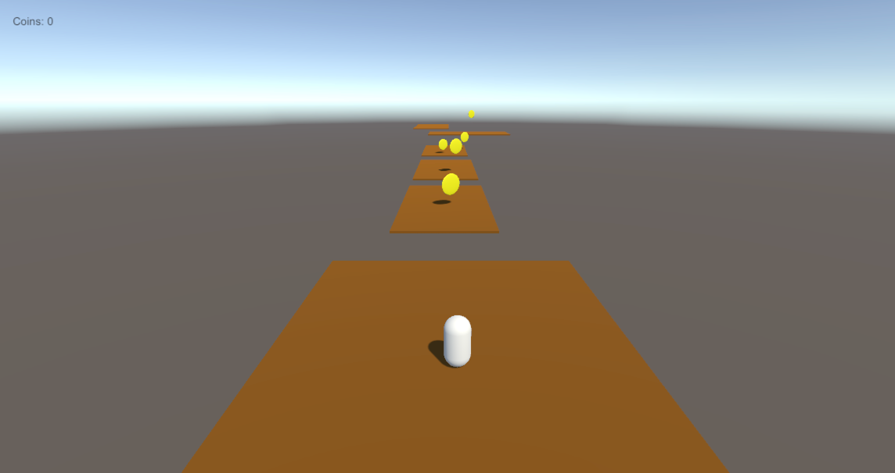
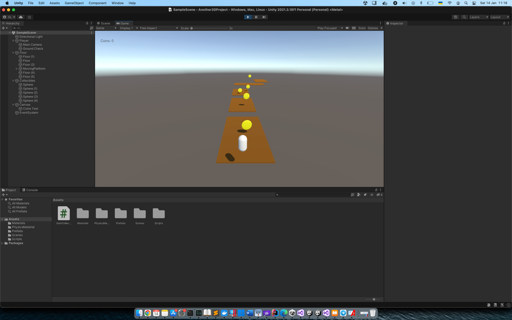
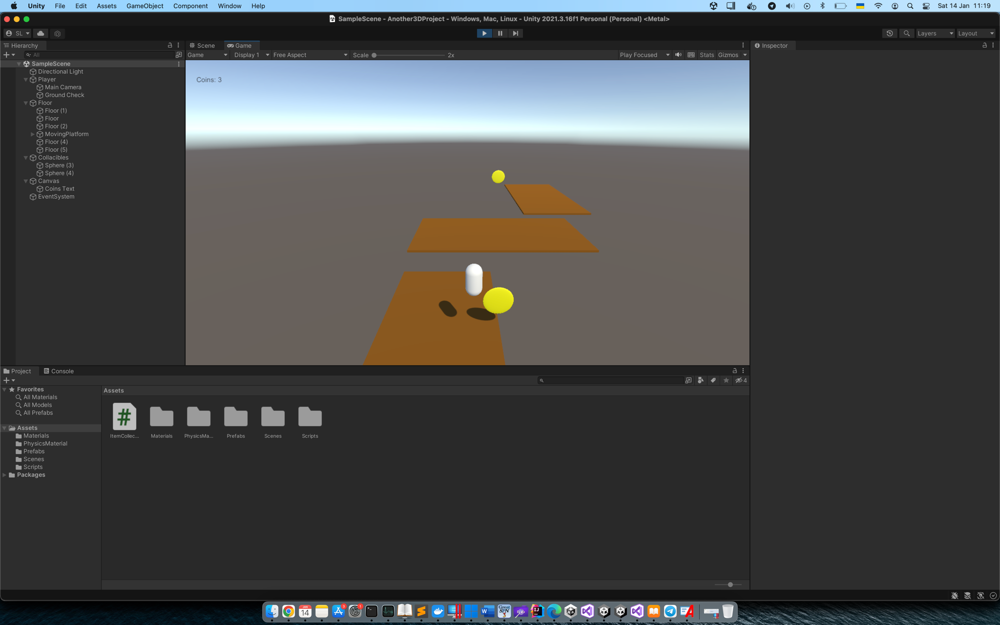

3D Game "Монетозбір"

Суть гри - встигнути зібрати монети та не впасти

Головний персонаж гри - овал.

- Реалізовано функціонал руху, стрибку, взаємодія між обєктами
- Реалізований функціонал з підрахунку обєктів та вивід на екран
- Є рухомі обєкти у вигляді панелі
- Є також анімація монет

screenshots:

